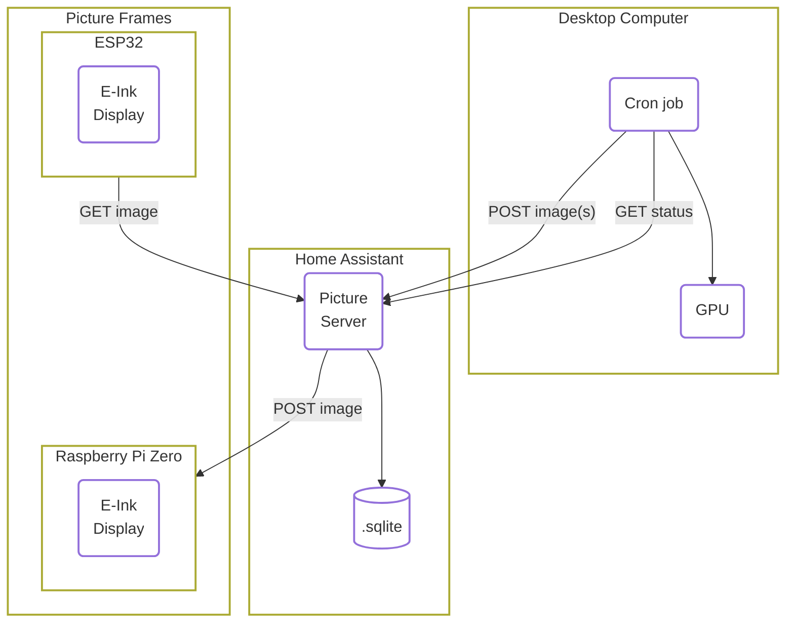
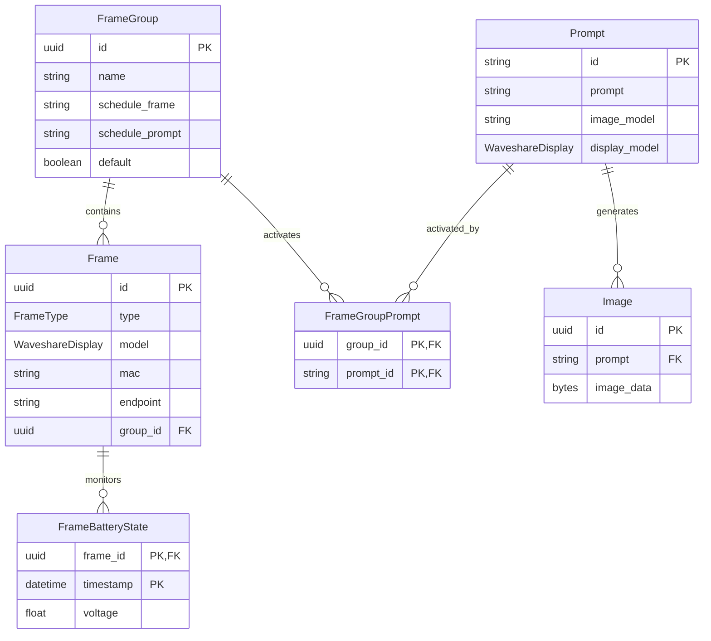
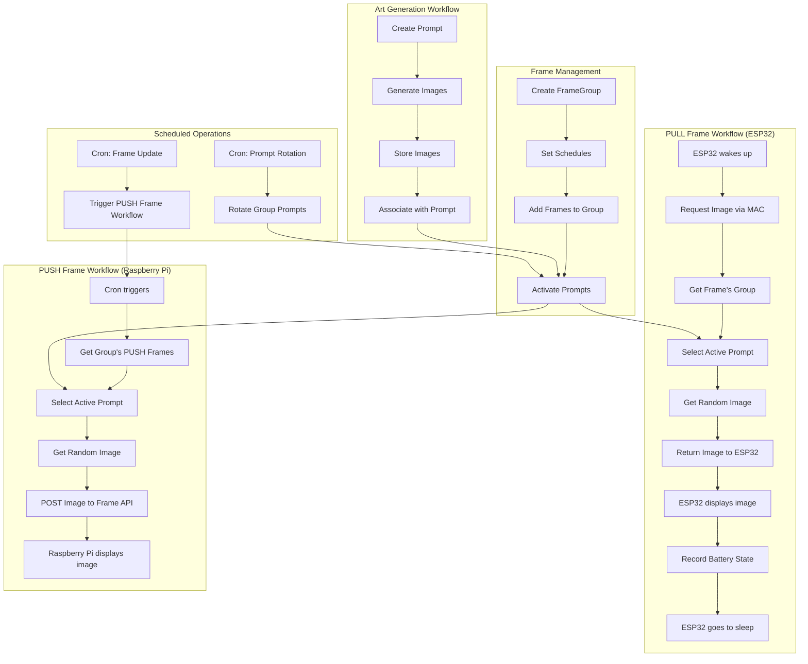

# Building Your Own AI & E-Ink Powered Art Gallery

The write-up can be found at [https://charnley.github.io/blog/2025/04/02/e-ink-ai-esp32-local-art-gallery.html](https://charnley.github.io/blog/2025/04/02/e-ink-ai-esp32-local-art-gallery.html)

The different services can be found `/services/*`.

## Database Workflow

- The **picture server** stores a list of AI prompts, each with its associated images, in an SQLite database. For our setup, this is hosted on **Home Assistant as an Add-on**, but it could easily run on any Docker hosting service.
- Every night, the **desktop computer** checks the picture server for prompts that need images. For each prompt, the desktop computer generates new images and sends them to the server.
- The **ESP32-powered picture frame(s)** follow a sleep schedule, staying off for 24 hours and waking up at 4 am. When it wakes up, it requests a picture, displays it, and then goes back to sleep.
- The **Raspberry Pi-powered picture frame(s)** host an API for displaying images, so you can send live notifications or images directly to the frame.
