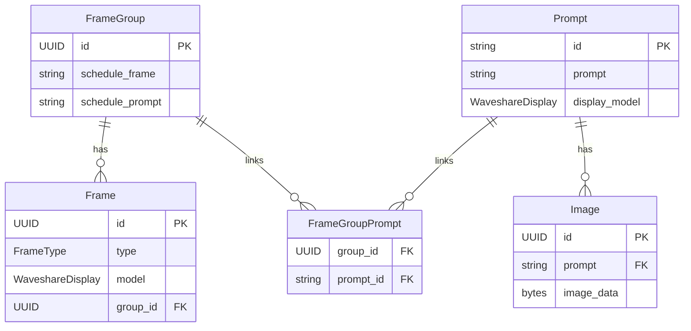

# Service for hosting and selecting images for e-ink displays

## Overview

- FrameGroup → Frame: One group can have many frames.
- FrameGroup → Prompt via FrameGroupPrompt: Many-to-many link table, optionally with order for rotation.
- Prompt → Image: One prompt can have many images.
- Frame → FrameGroup: Each frame belongs to a group.
- Display type (WaveshareDisplay) is shared between Frame.model and Prompt.display_model.

## Group setup example

if you want the standard where gallery is updated during the night.
Here prompts are rotated at 3am, and frames are updated at 3:30 am.

    00 3 * * * # prompt update schedule
    30 3 * * * # frame update schedule

if you want a party night, where photos are updated every 20th min, then do something like this.
Given that your party is from 18 to 23.
Here we use the offset of time so the prompt update is done 10 min before the frames are updated.
A good party always have a cron schdule.

    50/20 17-23 * * * # prompt update schedule
    0/20 18-23 * * * # frame update schedule

Visit https://crontab.guru to write a good cron, or use some chatbot.

## Bulk configure

Need to reconfigure your frames after a database, do a dump and store the configuration.
Remove the id's though.

    {
        "name": "LivingRoom",
        "schedule_frame": "30 3 * * *",
        "schedule_prompt": "0 3 * * *",
        "default": true,
        "frames":[
            {
                "mac": "AA:BB:CC:DD:66:88",
                "type": "pull"
            }
        ]
    }

## References:

- https://developers.home-assistant.io/docs/add-ons/tutorial/
- https://developers.home-assistant.io/docs/add-ons/configuration/
- https://developers.home-assistant.io/docs/add-ons/communication/
- https://atmotube.com/atmocube-support/integrating-home-assistant-via-mqtt

## API Endpoints

| Endpoint | Method | Description |
|----------|--------|-------------|
| **Frames** (`/frames`) | | |
| `/frames/` | GET | List all frames, optional filter by type |
| `/frames/{id}` | GET | Get specific frame by UUID |
| `/frames/{id}` | DELETE | Delete a frame |
| `/frames/{id}` | PATCH | Update frame details |
| `/frames/` | POST | Create new frame (PUSH or PULL type) |
| `/frames/by-mac/{mac_address}/get-sleep-duration` | GET | Get sleep duration for MAC address |
| `/frames/by-mac/{mac_address}/display.png` | GET | Get display image for MAC address |
| `/frames/{id}/battery` | POST | Add battery status reading |
| `/frames/{id}/battery` | GET | Get battery status history |
| `/frames/{id}/battery/status` | GET | Evaluate battery status |
| **Groups** (`/groups`) | | |
| `/groups/` | GET | List all frame groups |
| `/groups/{id}` | GET | Get specific group |
| `/groups/{id}` | DELETE | Delete group (unassigns frames first) |
| `/groups/` | POST | Create new group with cron schedules |
| `/groups/{id}` | PATCH | Update group details |
| `/groups/{id}/schedule` | GET | Get upcoming schedule timestamps |
| `/groups/{id}/frames` | GET | Get frames in group |
| `/groups/{id}/frames` | POST | Add frame to group |
| `/groups/{id}/frames/{frame_id}` | DELETE | Remove frame from group |
| `/groups/{id}/refresh` | POST | Push images to all PUSH frames in group |
| `/groups/{id}/prompts` | POST | Get prompts for group |
| `/groups/{id}/prompts/rotate` | POST | Rotate prompts for group |
| **Images** (`/images`) | | |
| `/images/` | GET | List all images |
| `/images/{id}` | GET | Get image metadata |
| `/images/{id}` | DELETE | Delete image |
| `/images/{id}/display.png` | GET | Get image file (optional dithering) |
| `/images/` | POST | Upload images (requires prompt owner) |
| **Prompts** (`/prompts`) | | |
| `/prompts/` | GET | List prompts (filter: "missing" for prompts without images) |
| `/prompts/all` | DELETE | Delete all prompts and images |
| `/prompts/{id}` | GET | Get specific prompt |
| `/prompts/{id}/images` | GET | Get images for prompt |
| `/prompts/{id}` | DELETE | Delete prompt and its images |
| `/prompts/` | POST | Create new prompt (generates hash ID) |
| **System** (`/system`) | | |
| `/system/get-time` | GET | Get current timestamp |
| `/system/get-disk-usage` | GET | Get database disk usage |
| `/system/export/groups` | GET | Export all groups with frames |
| `/system/import/groups` | POST | Import groups with frames |

## TODO

- Fix the esphome, so it doesn't loop on error, display error msg and sleep

## Alternatives:

- https://usetrmnl.com
