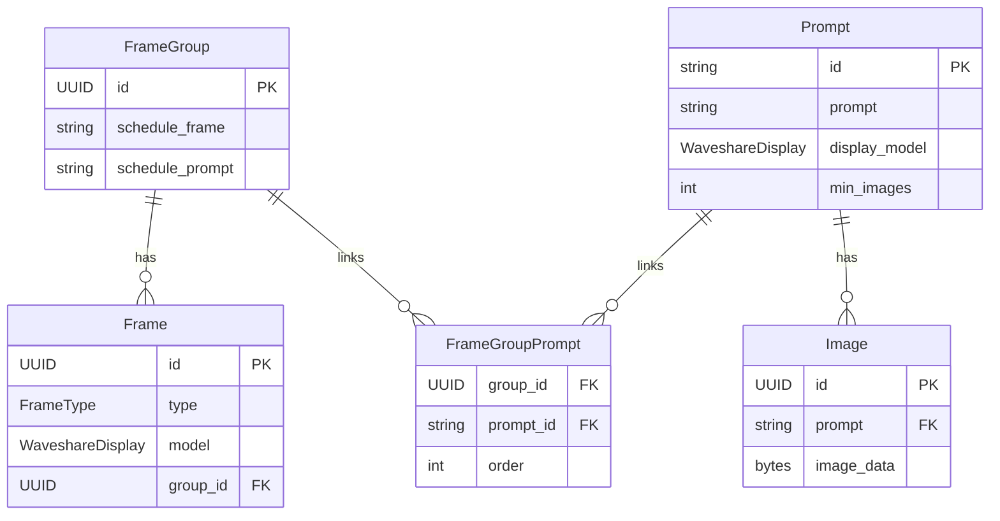

# Service for hosting and selecting images for e-ink displays

## Overview

- FrameGroup → Frame: One group can have many frames.
- FrameGroup → Prompt via FrameGroupPrompt: Many-to-many link table, optionally with order for rotation.
- Prompt → Image: One prompt can have many images.
- Frame → FrameGroup: Each frame belongs to a group.
- Display type (WaveshareDisplay) is shared between Frame.model and Prompt.display_model.

## References:

- https://developers.home-assistant.io/docs/add-ons/tutorial/
- https://developers.home-assistant.io/docs/add-ons/configuration/
- https://developers.home-assistant.io/docs/add-ons/communication/
- https://atmotube.com/atmocube-support/integrating-home-assistant-via-mqtt

## Alternatives:

- https://usetrmnl.com
