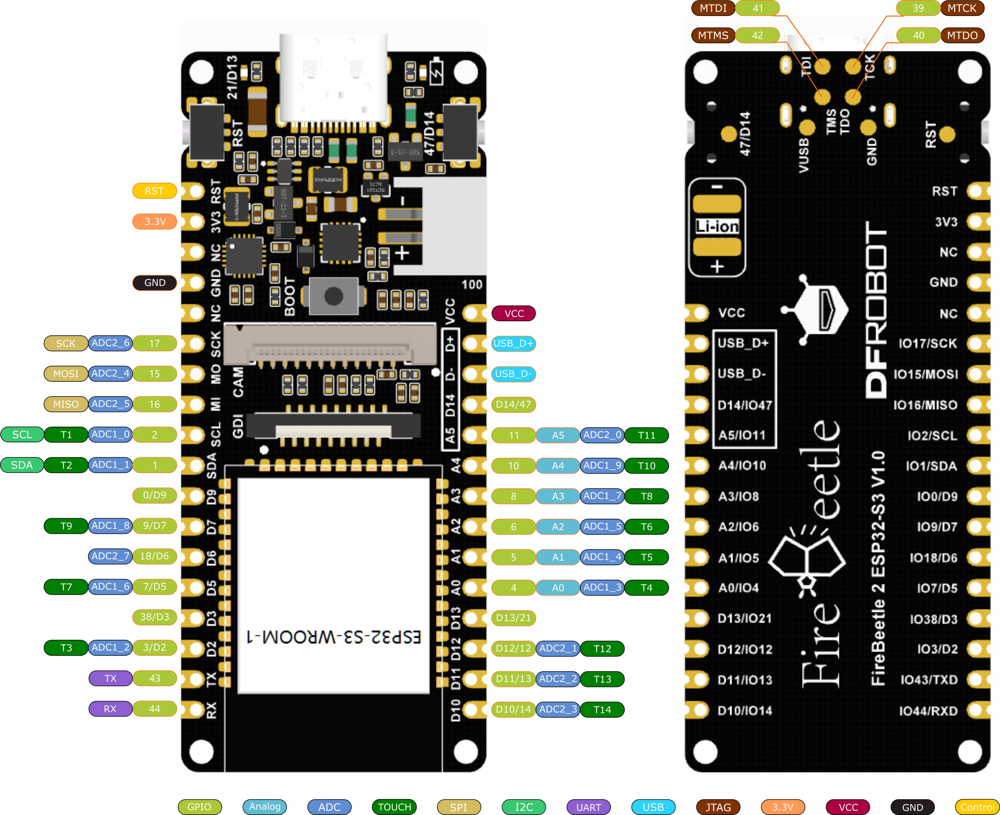
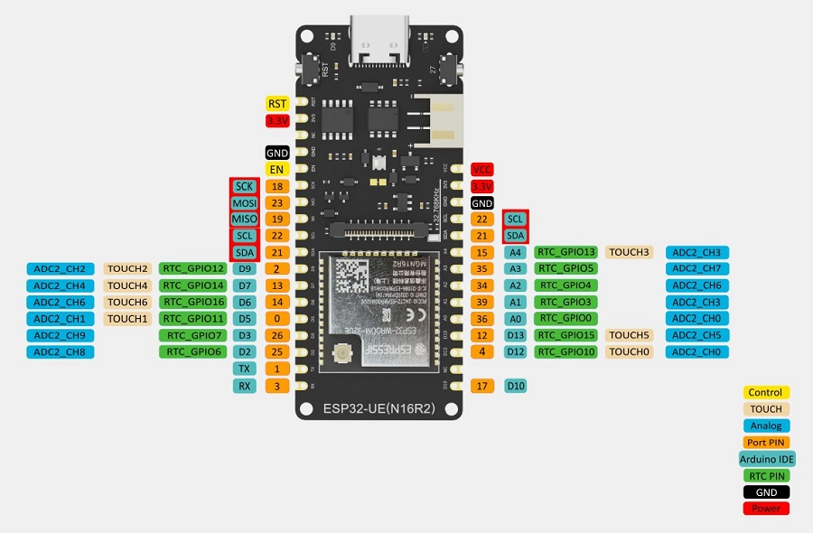

# Hardware
- [13.3 inch K epaper from waveshare](https://www.waveshare.com/product/raspberry-pi/displays/e-paper/13.3inch-e-paper-hat-k.htm)
- [Universal e-Paper Raw Panel Driver HAT](https://www.waveshare.com/e-paper-driver-hat.htm)
- a specific esp32: [FireBeetle 2 Board ESP32-S3 (N16R8) AIoT Microcontroller with Camera (16MB Fl., 8MB PS., Wi-Fi & BT on Board)](https://www.dfrobot.com/product-2676.html)
- a usb battery

# hardware tools
- soldering iron
- solder

# software
- install the latest version of esphome(atleast 2024.8.0)
```
python -m venv venv
. ./venv/bin/activate
pip install esphome
pip install python-magic-bin
pip install python-magic
pip install "pillow==10.2.0"
```

# no HA support
- copy the create a copy of src/esphome/secrets.yaml.example into src/esphome/secrets.yaml
  - `cp src/esphome/secrets.yaml.example src/esphome/secrets.yaml`
  - edit with the right passwords and ssid for wifi
- connect your esp32 the computer
- run `esphome run src/esphome/boards/firebeetle-esp32-s3-wroom-1u/online-image-13.3-simple.yaml`
- wait until you see output and it changes

# HA support

run
```
esphome -s device_id living_room -s wifi_ssid yourssid -s wifi_password yourpassword run boards/firebeetle-esp32-s3-wroom-1u/online-image-13.3-ha.yaml
```
eink_frame will be prefixed on the name so it becomes `eink_frame_living_room`, it must be unique.

##
# useful links

## esphome

- https://github.com/esphome/esphome

## Waveshare 13.3 inch K epaper

- https://www.waveshare.com/wiki/13.3inch_e-Paper_HAT_(K)
- https://github.com/waveshareteam/e-Paper/tree/master
- https://www.waveshare.com/wiki/13.3inch_e-Paper_HAT_(K)_Manual#Resource

## E-paper Driver HAT

- https://www.waveshare.com/wiki/E-Paper_Driver_HAT

## esp32 board

- https://files.waveshare.com/upload/4/4a/E-Paper_ESP32_Driver_Board_user_manual_en.pdf

## home assistant store files

- https://www.home-assistant.io/integrations/http/#hosting-files

# settings

CLK and SCK is the same thing:
> in SPI (Serial Peripheral Interface), CLK (Clock) and SCK (Serial Clock) refer to the same signal. 
DIN = MOSI

## e-paper Driver HAT
there are 2 types of boards, set 13.3 to B type
- Display Config: B
- Interface Config: 0

| Wire Color | Connection |
|------------|------------|
| 🩶 Grey    | VCC/3.3v   |
| 🟤 Brown   | GND        |
| 🔵 Blue    | DIN/MOSI   |
| 🟡 Yellow  | CLK/SCK    |
| 🟠 Orange  | CS         |
| 🟢 Green   | DC         |
| ⚪️ White   | RST        |
| 🟣 Purple  | Busy       |
| 🔴 Red     | PWR        |

# DFRobot DFR0975 firebeetle-esp32-s3-wroom-1u wiring

product page: https://wiki.dfrobot.com/SKU_DFR0975_FireBeetle_2_Board_ESP32_S3

| Wire Color | HAT Driver  | ESP32 Pin    |
|------------|-------------|--------------|
| 🩶 Grey    | VCC/3.3v    | 3V3          |
| 🟤 Brown   | GND         | GND          |
| 🔵 Blue    | DIN/MOSI    | A5  / IO11   |
| 🟡 Yellow  | CLK/SCK     | D12 / IO12   |
| 🟠 Orange  | CS          | A4  / IO10   |
| 🟢 Green   | DC          | D7  / IO9    |
| ⚪️ White   | RST         | A0  / IO4    |
| 🟣 Purple  | Busy        | D5  / IO7    |
| 🔴 Red     | PWR         | SCL / IO2    |



# DFRobot DFR1140 firebeetle-esp32-s3-wroom-32e wiring
> FireBeetle 2 ESP32-UE (N16R2) IoT Microcontroller (16MB Fl., 2MB PS., Supports Ext Antenna, Wi-Fi & Bluetooth)
product page: 
https://wiki.dfrobot.com/_SKU_DFR1140_FireBeetle_2_ESP32_UE_N16R2_IoT_Microcontroller


| Wire Color | HAT Driver  | FireBeetle ESP32-UE Pin (Left Side) |
|------------|-------------|-------------------------------------|
| 🩶 Grey    | VCC/3.3v    | 3V3                                |
| 🟤 Brown   | GND         | GND                                |
| 🔵 Blue    | DIN/MOSI    | GPIO35 (A3)                        |
| 🟡 Yellow  | CLK/SCK     | GPIO18 (SCK)                       |
| 🟠 Orange  | CS          | GPIO21 (SDA)                       |
| 🟢 Green   | DC          | GPIO13 (D7)                        |
| ⚪ White   | RST         | GPIO14 (D6)                        |
| 🟣 Purple  | Busy        | GPIO34 (A2)                        |
| 🔴 Red     | PWR         | GPIO25 (D2)                        |


### accelerometer

I2C Pin Connections:
| ADXL345 Pin | ESP32 Pin      |
|-------------|----------------|
| VCC         | 3.3V          right side  |
| GND         | GND           right side  |
| SDA         | GPIO 21 (SDA) right side  |
| SCL         | GPIO 18 (SCL) right side  |
| CS          | VCC (to enable I2C) |

### on-off switch
I2C
| DFRobot1140 | Switch      |
|-------------|-------------|
| GND         | GND         |
| Other       | GPIO 04 (D12) |
